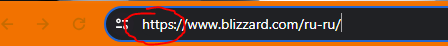
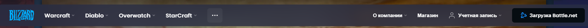
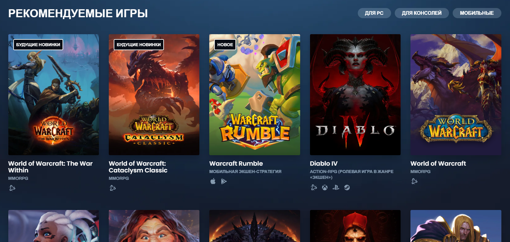
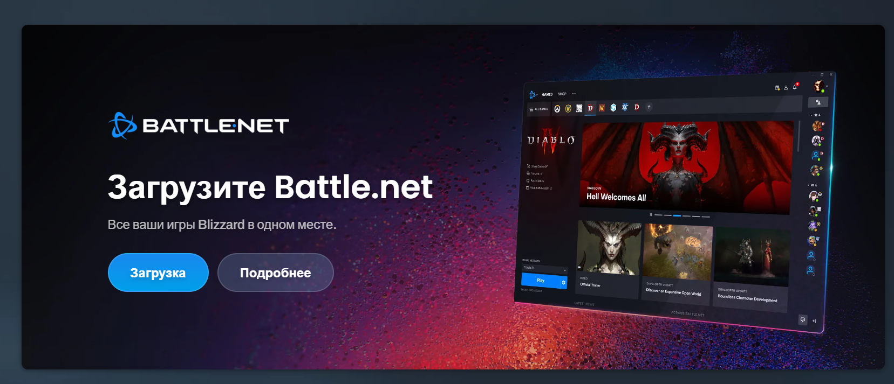
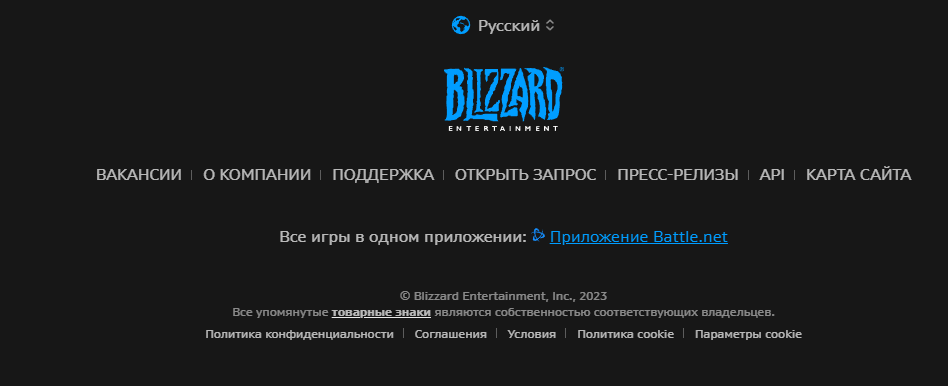
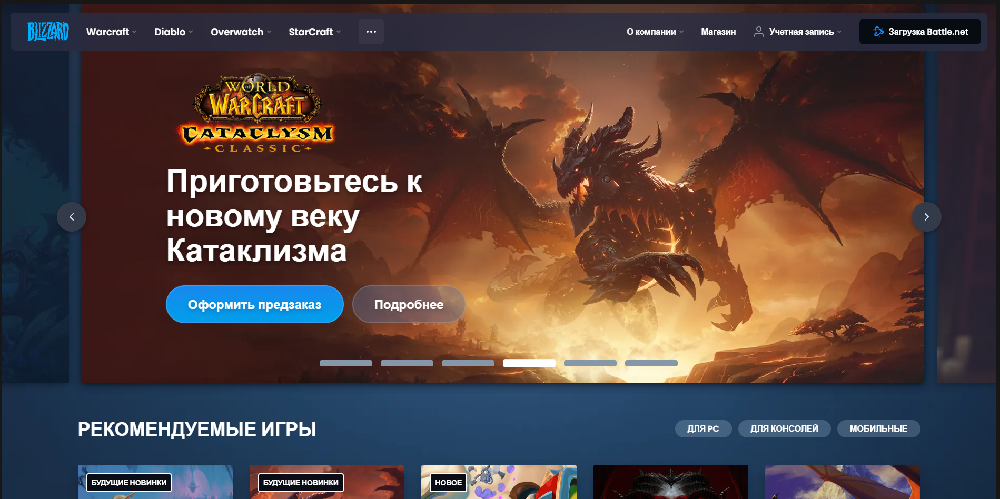
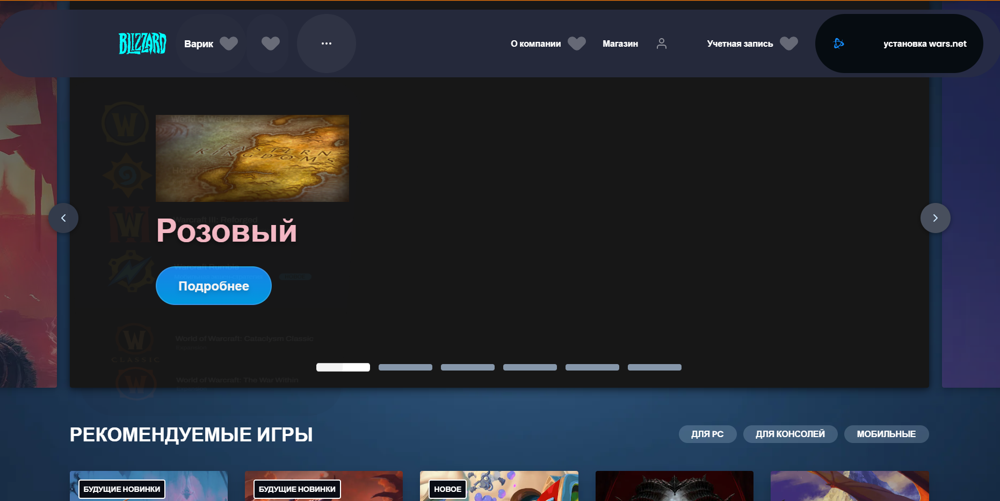
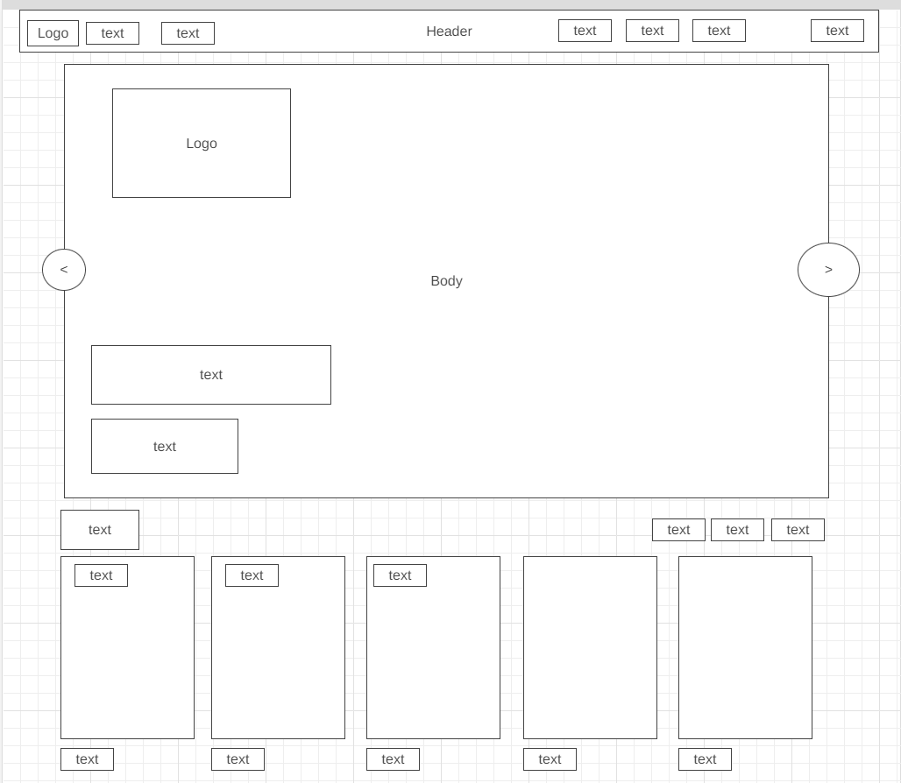

# Урок 1. Веб-технологии: вчера, сегодня, завтра

### Задача: на основе сайта на свой выбор:
- Определите, на каком протоколе работает сайт.
- Проанализируйте структуру страницы сайта.
- Внесите не менее 10 изменений на страницу с помощью инструмента разработчика и представьте скриншоты было/стало.
- Создайте прототип низкой детализации (дополнительное задание, если на семинаре дошли до задания №8). --> [Сайт](https://wireframe.cc/)

##
### Решение:

[Blizzard](https://www.blizzard.com/ru-ru/)

- Протокол - https

##
- Анализ структуры страницы https://www.blizzard.com/ru-ru/
1. Заголовок (Header):

- Логотип Blizzard, который является кликабельной ссылкой на главную страницу.
- Навигационное меню с основными разделами по играм, о компании, магазин и.т.д
- Наличие элементов связи с пользователем - кнопка "Sign In".
- Наличие кнопки запуска приложения Blizzard - кнопка "Загрузка Battle.net"

2. Баннер:

- Крупное изображения, рекламирующего основной продукт или событие.
- Кнопка с дами в разные разделы (в зависимости от баннера
- Кнопка переключение баннера на следующий или предыдущий)

3. Разделы с Играми:

- Блоки с информацией о основных играх Blizzard, с небольшим превью-видео при наведении.
- Кнопки и ссылки для получения дополнительной информации о каждой игре или перехода в ее раздел в приложении

4. Баннер2:

- Крупное изображения, предлагающее установить приложение (лаунчер) и кновки загрузки и подробного описания.

4. Подвал (Footer)

- Блок с выбором языка
- Логотип Blizzard, который является кликабельной ссылкой на главную страницу.
- Кнопки для перехода в различные разделы.
- Текст + ссылка на приложение (лайнчер)
- Информация о компании Blizzard, правовая информация и соглашения.

## Заключение
Общая структура страницы включает в себя навигационное меню, банннеры, информацию о играх, новости, магазин, события и полезные ссылки. Footer содержит дополнительные ссылки, информацию о компании и соглашения.
##
- Изменения на сайте

1. Было:

2. Стало:

Список изменений:
- Изменение текста
- Изменение цветов
- Добавление элементов
- Удаление элементов
- Изменение стилей
- Скрытие элементов
- Изменение размеров
- Добавление анимаций
- Изменение ссылок
- Модификация форм

## 
- Прототип:

